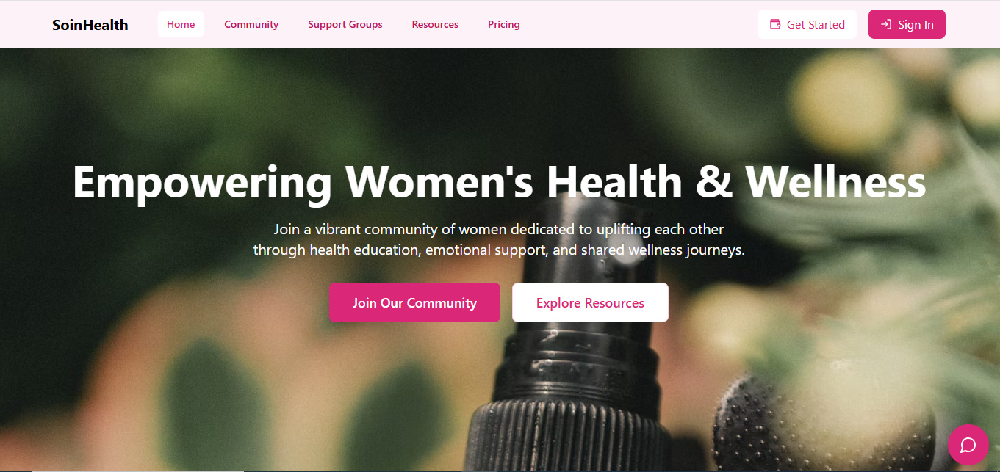

# SoinHealth

---
SoinHealth is a women-focused digital healthcare platform designed to empower women by providing access to health resources, support groups, and community features in a safe and inclusive environment. This platform also integrates advanced cryptocurrency wallet features and secure user authentication.

---
## Table of Contents
#### 1. Overview
#### 2. Features
#### 3. Technologies Used
#### 4. Getting Started
#### 5. Usage Guide
#### 6. Configuration Details
#### 7. Acknowledgements

---
### Features
Women-Centric Community: Designed specifically for women’s health, creating a safe space for discussion and support.
Secure Authentication: Allows users to sign in using Google OAuth and Okto, ensuring a secure and convenient login experience.
User-Friendly Navbar: Easy navigation to key sections like Home, Community, Support Groups, Resources, and Pricing.
Personalized Experience: Welcomes returning users with a personalized greeting that displays their username if logged in.
Get Started Button: Offers quick access for new users to sign up and explore the platform.
Mobile-Responsive Design: Provides a seamless experience on all devices with a collapsible menu for mobile navigation.
Support and Resources: Access to resources and support groups to foster connection and provide guidance on health-related topics.

---
### Technologies Used
Frontend: React, TypeScript, CSS
Icons: Lucide Icon
Authentication: Google OAuth, Okto SDK
Integration : Particle Wallet
AI Chatbot : Google Gemini API

