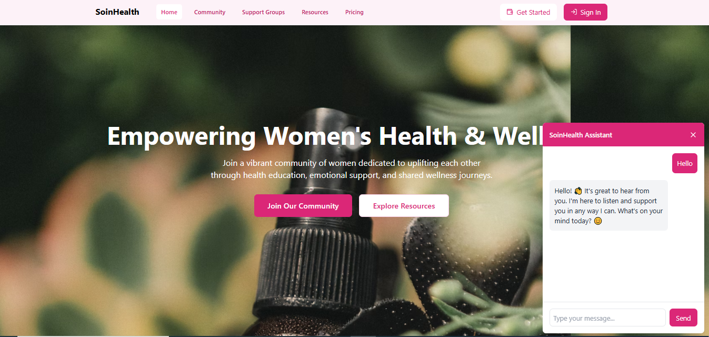

# SoinHealth

---
SoinHealth is a women-focused digital healthcare platform built to empower women by providing a secure, inclusive space to manage health information, connect with support groups, and access resources tailored to their well-being. The platform is designed to meet women’s unique health needs, offering access to mental health support, community discussions, and resources on various health topics. By fostering a supportive online environment, SoinHealth enables women to make informed decisions, share experiences, and engage with health-focused communities, all within a secure and user-friendly interface.



---
## Table of Contents
#### 1. Overview
#### 2. Features
#### 3. Technologies Used
#### 4. Getting Started
#### 5. Usage Guide
#### 6. Configuration Details
#### 7. Acknowledgements

---
## Features

### 1. **Okto for Sign-In**
- **Okto** is used for secure user authentication.

- Users can sign in using their **Okto** credentials to manage their health information securely.

- Continue with Google
  


### 2. **Particle Wallet Integration**
- **Particle Network** is integrated for seamless wallet functionality.
- Users can securely store and manage their health-related financial transactions.
- With **Particle Wallet**, users can access their wallet directly within the app for easy payments, donations, and financial management.


### 3. **AI Chatbot - Powered by Gemini API**
- The app includes an **AI Chatbot** to assist users with personalized health information.
- The **Gemini API** is used for the chatbot’s conversational abilities.
- The AI is designed to answer frequently asked questions, provide information on health topics, and assist in navigating resources.


### 4. **Support Groups**
- **Support Groups** allow users to connect with others facing similar health challenges.
- Users can join different groups to share experiences, provide support, and receive guidance.
- Each support group is tailored to specific health conditions, providing a community of people with shared experiences.


### 5. **Community Chat**
- **Community Chat** enables real-time communication between users.
- This feature fosters a sense of community, encouraging users to share advice, insights, and connect with others.
- The chat supports direct messaging, group chats, and moderated forums to ensure safe and productive conversations.


---
### Technologies Used
Frontend: React, TypeScript, CSS
Authentication: Google OAuth, Okto SDK
Integration : Particle Wallet
AI Chatbot : Google Gemini API
Icons: Lucide Icon

---

## Installation

### Prerequisites
- **Node.js** installed
- **Google Cloud Console** account for Google OAuth `Client ID`
- **Okto** account for `OKTO_CLIENT_API_KEY`
- **Particle Network** account for `Project ID`, `Client ID`, and `App ID`
- **Google Gemini** Google AI studio `Gemini_API_KEYS`

### Steps

1. Clone the repository:

   ```bash
   https://github.com/Fatumayattani/soin_okto_particle_network.git
   cd soin_okto_particle_network
   ```

2. Install dependencies:

   ```bash
   npm install
   ```

3. Create a `.env` file in the root directory and add the following environment variables:

   ```plaintext
   REACT_APP_GOOGLE_CLIENT_ID=your-google-client-id
   REACT_APP_OKTO_CLIENT_ID=your-okto-client-id
   REACT_APP_PARTICLE_PROJECT_ID=your-particle-project-id
   REACT_APP_PARTICLE_CLIENT_ID=your-particle-client-id
   REACT_APP_PARTICLE_APP_ID=your-particle-app-id
   ```

   - Replace `your-google-client-id` with your **Google Cloud OAuth Client ID**.
   - Replace `your-okto-client-id` with your **Okto Client ID**.
   - Replace `your-particle-project-id`, `your-particle-client-id`, and `your-particle-app-id` with your **Particle Network Project ID**, **Client ID**, and **App ID**, respectively.

## Usage

To run the project locally, use:

```bash
npm start
```

This will start the app on [http://localhost:5173](http://localhost:5173).

## User Guide

### Navigation

- Use the top navbar to navigate through various sections: **Home**, **Community**, **Support Groups**, **Resources**, and **Pricing**.
- The **"Sign In"** button offers secure access via Google OAuth, Okto, or Particle Wallet, allowing users to safely manage their health information and wallet integrations.

### Responsive Design

- A mobile menu icon appears on smaller screens, allowing easy access to navigation links.
- Users can log in or sign up seamlessly across devices.

